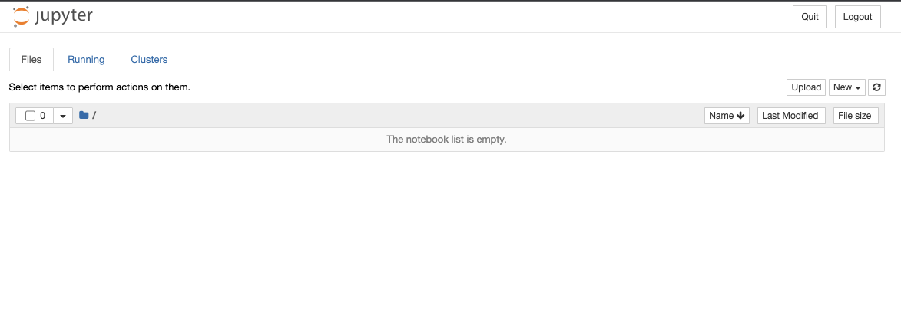
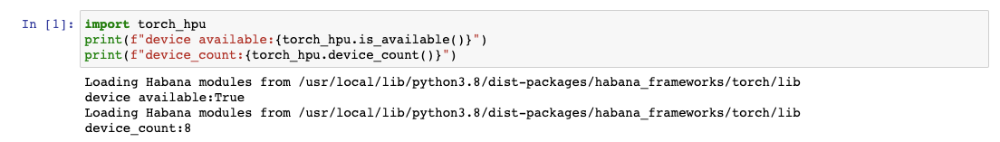

# Getting Started with Deep Learning on Habana Gaudi with Hugging Face

This repository contains instructions for getting started with Deep Learning on Habana Gaudi with Hugging Face libraries like [transformers](https://huggingface.co/docs/transformers/index), [optimum](https://huggingface.co/docs/optimum/index), [datasets](https://huggingface.co/docs/datasets/index). This guide will show you how to set up the develoment environment on the AWS cloud and get started with Hugging Face Libraries. It doesn't contain a detailed guide on how to fine-tune models. This is covered in this [post](https://todo.com).

This guide will cover:

1. [Requirements](#1-requirements)
2. [Create an AWS EC2 instance](#2-create-an-aws-ec2-instance)
3. [Connect to the instance via ssh](#3-connect-to-the-instance-via-ssh)
4. [Use Jupyter Notebook/Lab via ssh](#4-use-jupyter-notebook-lab-via-ssh)
5. [Fine-tune Hugging Face Transformers with Optimum](#5-fine-tune-hugging-face-transformers-with-optimum)
6. [Clean up](#6-clean-up)

Or you can jump to the [Conclusion](#conclusion).

Let's get started! 🚀

## 1. Requirements

* AWS Account with quota for [DL1 instance type](https://aws.amazon.com/ec2/instance-types/dl1/)
* [AWS CLI](https://docs.aws.amazon.com/cli/latest/userguide/getting-started-install.html) installed
* AWS IAM user configured with permission to create and manage ec2 instances


## 2. Create an AWS EC2 instance

Before we can launch or AWS DL1 instance we have to create a `key-pair` and `security-group`, which we will use to access the instance.

Configure AWS PROFILE and AWS REGION which will be used for the instance

```bash
export AWS_PROFILE=<your-aws-profile>
export AWS_DEFAULT_REGION=<your-aws-region>
export AWS_PROFILE=sandbox
export AWS_DEFAULT_REGION=us-east-1
```

First we create a key pair, which will be used later to ssh into the instance. 
```bash
KEY_NAME=habana
aws ec2 create-key-pair --key-name ${KEY_NAME} --query 'KeyMaterial' --output text > ${KEY_NAME}.pem
chmod 400 ${KEY_NAME}.pem
```
  
Then we create a security group, which allows SSH access to the instance. We are going to use the default VPC for it, but can adjust the `vpc-id` arg if you want to modify it.
```bash
SG_NAME=habana
DEFAULT_VPC_ID=$(aws ec2 describe-vpcs --query 'Vpcs[?isDefault==true].VpcId' --output text)
echo "Default VPC ID: ${DEFAULT_VPC_ID}"
SECURITY_GROUP_ID=$(aws ec2 create-security-group --group-name ${SG_NAME}-sg --description "SG for Habana Deep Learning" --vpc-id ${DEFAULT_VPC_ID} --output text)
echo "Security Group ID: ${SECURITY_GROUP_ID}"
echo $(aws ec2 authorize-security-group-ingress --group-id ${SECURITY_GROUP_ID} --protocol tcp --port 22 --cidr 0.0.0.0/0 --output text)
```

After we have successfully made sure that we can use the Gaudi machine in a secure environment it is time to create the instance.
  
To use the official marketplace image you have to subscribe on the UI first and then you can access it with the following command `AMI_ID=$(aws ec2 describe-images --filters "Name=name,Values=* Habana Deep Learning Base AMI (Ubuntu 20.*"  --query 'Images[0].ImageId' --output text)`. In the guide we are using the community version, which is the exact same version as the official one.

```bash
AMI_ID=$(aws ec2 describe-images --filters "Name=name,Values=*habanalabs-base-ubuntu20.04*"  --query 'Images[0].ImageId' --output text)
echo "AMI ID: ${AMI_ID}"
INSTANCE_TYPE=dl1.24xlarge
INSTANCE_NAME=habana

aws ec2 run-instances \
  --image-id ${AMI_ID} \
  --key-name ${KEY_NAME} \
  --count 1 \
  --instance-type ${INSTANCE_TYPE} \
  --security-group-ids ${SECURITY_GROUP_ID} \
  --block-device-mappings 'DeviceName=/dev/sda1,Ebs={VolumeSize=150}' \
  --tag-specifications "ResourceType=instance,Tags=[{Key=Name,Value=${INSTANCE_NAME}-demo}]"
```

_P.S. you can also use the `start_instance.sh` script from [Github repository](https://github.com/philschmid/deep-learning-habana-huggingface) which does all of the steps above._

## 3. Connect to the instance via ssh

After around 45-60secondes we can connect to the Habana Gaudi instance via ssh. We will use the following command to get the public IP and then ssh into the machine using the earlier created key pair.

```bash
INSTANCE_NAME=habana
PUBLIC_DOMAIN=$(aws ec2 describe-instances --profile sandbox \
    --filters Name=tag-value,Values=${INSTANCE_NAME}-demo  \
    --query 'Reservations[*].Instances[*].PublicDnsName' \
    --output text)
ssh -i ${KEY_NAME}.pem ubuntu@${PUBLIC_DOMAIN//[$'\t\r\n ']}
```

Lets see if we can access the Gaudi devices. Habana provides a similar CLI tool like `nvidia-smi` with `hl-smi` command.
You can find more documentation [here](https://docs.habana.ai/en/latest/Management_and_Monitoring/System_Management_Tools_Guide/System_Management_Tools.html).
```bash
hl-smi
```
You should a similar output that below.


We can also test if we can allocate the `hpu` device in `PyTorch`. Therefore we will pull the latest docker image with torch installed and run `python3` with the code snippet below. A more detailed guide can be found in [Porting a Simple PyTorch Model to Gaudi](https://docs.habana.ai/en/latest/PyTorch/Migration_Guide/Porting_Simple_PyTorch_Model_to_Gaudi.html).

start docker container with torch installed
```bash
docker run -it --runtime=habana -e HABANA_VISIBLE_DEVICES=all -e OMPI_MCA_btl_vader_single_copy_mechanism=none --cap-add=sys_nice --net=host --ipc=host vault.habana.ai/gaudi-docker/1.4.1/ubuntu20.04/habanalabs/pytorch-installer-1.10.2:1.4.1-11
```

Start a python3 session with `python3` and execute the code below

```python
import torch_hpu
print(f"device available:{torch_hpu.is_available()}")
print(f"device_count:{torch_hpu.device_count()}")
```

## 4. Use Jupyter Notebook/Lab via ssh

Connecting via ssh works as expected, but who likes to develop inside a terminal? In this section we will learn how to install `Jupyter` and `Jupyter Notebooks/Lab` and how to connect to have a better machine learning environment thant just a terminal. But for this to work we need to add port for fowarding in the ssh connection to be able to open it in the browser.

As frist we need to create a new `ssh` connection with port fowarding to port an from `8888`:
```bash
INSTANCE_NAME=habana
PUBLIC_DOMAIN=$(aws ec2 describe-instances --profile sandbox \
    --filters Name=tag-value,Values=${INSTANCE_NAME}-demo  \
    --query 'Reservations[*].Instances[*].PublicDnsName' \
    --output text)
ssh -L 8888:localhost:8888 -i ${KEY_NAME}.pem ubuntu@${PUBLIC_DOMAIN//[$'\t\r\n ']}
```

After we are connected we are again we are again starting our container with a mounted volume to not lose our data later.

```bash
docker run -it --runtime=habana -e HABANA_VISIBLE_DEVICES=all -e OMPI_MCA_btl_vader_single_copy_mechanism=none --cap-add=sys_nice --net=host --ipc=host -v /home/ubuntu:/home/ubuntu -w /home/ubuntu vault.habana.ai/gaudi-docker/1.4.1/ubuntu20.04/habanalabs/pytorch-installer-1.10.2:1.4.1-11
```

Next and last step is to install and run `jupyter`

```bash
pip install jupyter
jupyter notebook --allow-root
```
You should see a familiar jupyter output with a url to the notebook. 
```bash
http://localhost:8888/?token=c7a150a559c3e9d6d48d285f7023a341aaf94dac994d787d
```
We can click on it an a jupyter environment opens in our local browser.



We can now run similar tests as via the terminal. Therefore create a new notebook and run the following code:

```python
import torch_hpu
print(f"device available:{torch_hpu.is_available()}")
print(f"device_count:{torch_hpu.device_count()}")
```




## 5. Fine-tune Hugging Face Transformers with Optimum

Our development environments are set up. Now lets install and test the Hugging Face Transformers on habana. To do this we simply install the [transformers](https://github.com/huggingface/transformers) and [optimum[habana]](https://github.com/huggingface/optimum-habana) packages via `pip`. 

```bash
pip install transformers datasets
pip install git+https://github.com/huggingface/optimum-habana.git # workaround until release of optimum-habana
```

After we have installed the packages we can start fine-tuning a transformers model with the `optimum` package. Below you can find a simplified example fine-tuning `bert-base-uncased` model on the `emotion` dataset for `text-classification` task. This is a very simplified example, which only uses 1 Gaudi Processor instead of 8 and the `TrainingArguments` are not optimized.

```bash
from transformers import AutoModelForSequenceClassification, AutoTokenizer
from datasets import load_dataset
from optimum.habana import GaudiTrainer, GaudiTrainingArguments

# load pre-trained model and tokenizer
model = AutoModelForSequenceClassification.from_pretrained("bert-base-uncased", num_labels=6)
tokenizer = AutoTokenizer.from_pretrained("bert-base-uncased")

# load dataset
dataset = load_dataset("emotion")

# preprocess dataset
def tokenize_function(examples):
    return tokenizer(examples["text"], padding="max_length", truncation=True)

tokenized_datasets = dataset.map(tokenize_function, batched=True)

# define Gaudi Training Arguments
training_args = GaudiTrainingArguments(
  output_dir=".",
  use_habana=True,
  use_lazy_mode=True,
  gaudi_config_name="Habana/bert-base-uncased",
  per_device_train_batch_size=48
)

# Initialize our Trainer
trainer = GaudiTrainer(
    model=model,
    args=training_args,
    train_dataset=tokenized_datasets["train"],
    tokenizer=tokenizer,
)

# Run training
trainer.train()
```

_We will create a more detailed guide on how to leverage the habana instances in the near future._

## 6. Clean up

To make sure we stop/delete everything we created you can follow the steps below.

1. Terminate the ec2 instance
```Bash
INSTANCE_NAME=habana
aws ec2 terminate-instances --instance-ids $(aws ec2 describe-instances --filters "Name=tag:Name,Values=${INSTANCE_NAME}-demo" --query 'Reservations[*].Instances[*].InstanceId' --output text) \
2>&1 > /dev/null
```

2. Delete security group. _can be delete once the instance is terminated_
```bash
SG_NAME=habana
aws ec2 delete-security-group --group-name ${SG_NAME}-sg
```

3. Delete key pair _can be delete once the instance is terminated_
```bash
KEY_NAME=habana
aws ec2 delete-key-pair --key-name ${KEY_NAME}
rm ${KEY_NAME}.pem
```

## 7. Conclusion

Thats it now you can start using Habana for running your Deep Learning Workload with Hugging Face Transformers. We walked through how to set up a development enviroment for Habana Gaudi via the the terminal or with a jupyter environment. In addition to this you can use `vscode` via [Remote Development using SSH](https://code.visualstudio.com/docs/remote/ssh) to connect to your instance and run your code.

The next step is to create an advanced guide for Hugging Face Transformers with Habana Gaudi to learn on how to use distributed training, configure our optimized `TrainingArguments` and pre-train models. Stay tuned!🚀

Until then you can check-out more examples in the [optimum-habana](https://github.com/huggingface/optimum-habana/tree/main/examples) respository.

---

Thanks for reading! If you have any questions, feel free to contact me, through [Github](https://github.com/huggingface/transformers), or on the [forum](https://discuss.huggingface.co/c/optimum/59). You can also connect with me on [Twitter](https://twitter.com/_philschmid) or [LinkedIn](https://www.linkedin.com/in/philipp-schmid-a6a2bb196/).