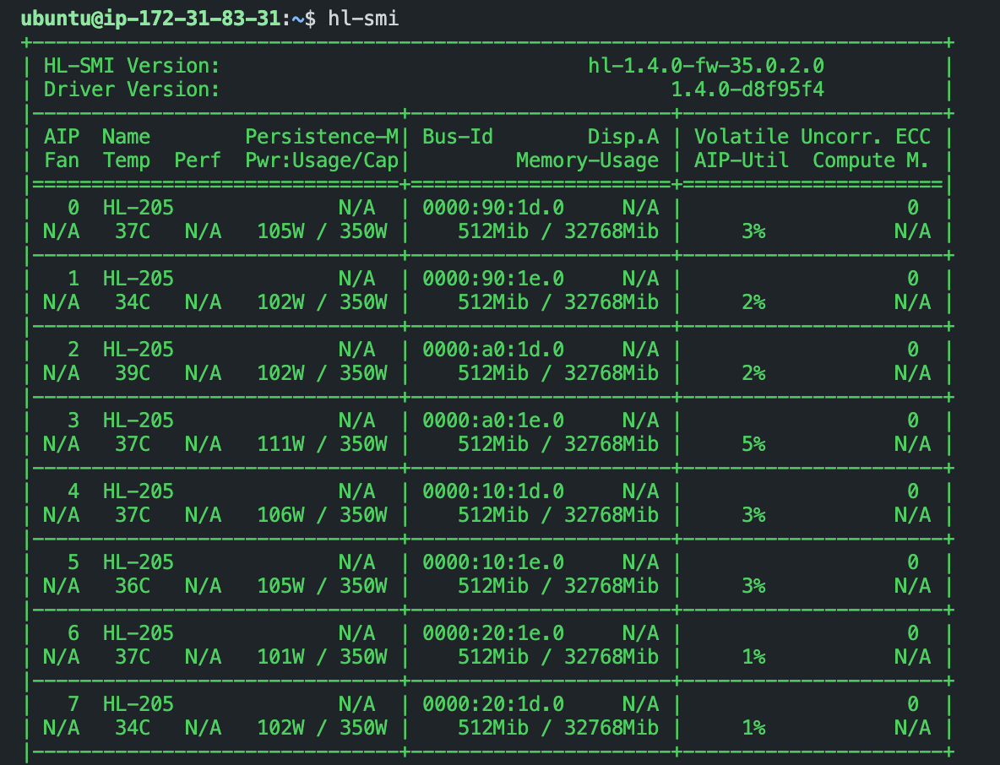
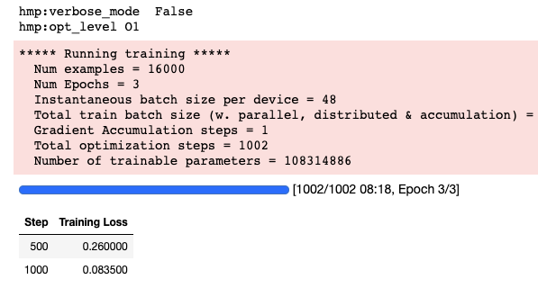

# Getting Started with Deep Learning on Habana Gaudi with Hugging Face

This repository contains instructions for getting started with Deep Learning on Habana Gaudi with Hugging Face libraries like [transformers](https://huggingface.co/docs/transformers/index), [optimum](https://huggingface.co/docs/optimum/index), [datasets](https://huggingface.co/docs/datasets/index). This guide will show you how to set up the development environment on the AWS cloud and get started with Hugging Face Libraries. 

A detailed guide/blog post can be found on [philschmid.de/getting-started-habana-gaudi](https://www.philschmid.de/getting-started-habana-gaudi).

This guide will cover:

1. [Requirements](https://www.philschmid.de/getting-started-habana-gaudi#1-requirements)
2. [Create an AWS EC2 instance](https://www.philschmid.de/getting-started-habana-gaudi#2-create-an-aws-ec2-instance)
3. [Connect to the instance via ssh](https://www.philschmid.de/getting-started-habana-gaudi#3-connect-to-the-instance-via-ssh)
4. [Use Jupyter Notebook/Lab via ssh](https://www.philschmid.de/getting-started-habana-gaudi#4-use-jupyter-notebook-lab-via-ssh)
5. [Fine-tune Hugging Face Transformers with Optimum](https://www.philschmid.de/getting-started-habana-gaudi#5-fine-tune-hugging-face-transformers-with-optimum)
6. [Clean up](https://www.philschmid.de/getting-started-habana-gaudi#6-clean-up)

Let's get started! 🚀

## Requirements

Before we can start make sure you have met the following requirements

* AWS Account with quota for [DL1 instance type](https://aws.amazon.com/ec2/instance-types/dl1/)
* [AWS CLI](https://docs.aws.amazon.com/cli/latest/userguide/getting-started-install.html) installed
* AWS IAM user [configured in CLI](https://docs.aws.amazon.com/cli/latest/userguide/cli-chap-configure.html) with permission to create and manage ec2 instances


## Create an AWS EC2 instance via `start_instance.sh`

```bash
export AWS_PROFILE=sandbox
export AWS_DEFAULT_REGION=us-east-1
```

```bash
./start_instance.sh
```

Connect with displayed `ssh` command.

Test Habana devices with docker command
```bash
docker run -ti --runtime=habana -e HABANA_VISIBLE_DEVICES=all -e OMPI_MCA_btl_vader_single_copy_mechanism=none --cap-add=sys_nice --net=host --ipc=host -v $(pwd):/home/ubuntu/dev --workdir=/home/ubuntu/dev vault.habana.ai/gaudi-docker/1.4.1/ubuntu20.04/habanalabs/pytorch-installer-1.10.2:1.4.1-11 hl-smi
```




Intall jupyter lab


```bash
docker run -it --runtime=habana -e HABANA_VISIBLE_DEVICES=all -e OMPI_MCA_btl_vader_single_copy_mechanism=none --cap-add=sys_nice --net=host --ipc=host -v /home/ubuntu:/home/ubuntu -w /home/ubuntu vault.habana.ai/gaudi-docker/1.5.0/ubuntu20.04/habanalabs/pytorch-installer-1.11.0:latest
```

```bash
pip install jupyter
git clone https://github.com/philschmid/deep-learning-habana-huggingface.git
cd fine-tuning
jupyter notebook --allow-root
```


## Fine-tune Hugging Face Transformers with Optimum

Our development environments are set up. Now let's install and test the Hugging Face Transformers on habana. To do this we simply install the [transformers](https://github.com/huggingface/transformers) and [optimum[habana]](https://github.com/huggingface/optimum-habana) packages via `pip`. 

```bash
pip install transformers datasets
pip install git+https://github.com/huggingface/optimum-habana.git # workaround until release of optimum-habana
```

After we have installed the packages we can start fine-tuning a transformers model with the `optimum` package. Below you can find a simplified example fine-tuning `bert-base-uncased` model on the `emotion` dataset for `text-classification` task. This is a very simplified example, which only uses 1 Gaudi Processor instead of 8 and the `TrainingArguments` are not optimized.

```python
from transformers import AutoModelForSequenceClassification, AutoTokenizer
from datasets import load_dataset
from optimum.habana import GaudiTrainer, GaudiTrainingArguments

# load pre-trained model and tokenizer
model = AutoModelForSequenceClassification.from_pretrained("bert-base-uncased", num_labels=6)
tokenizer = AutoTokenizer.from_pretrained("bert-base-uncased")

# load dataset
dataset = load_dataset("emotion")

# preprocess dataset
def tokenize_function(examples):
    return tokenizer(examples["text"], padding="max_length", truncation=True)

tokenized_datasets = dataset.map(tokenize_function, batched=True)

# define Gaudi Training Arguments
training_args = GaudiTrainingArguments(
  output_dir=".",
  use_habana=True,
  use_lazy_mode=True,
  gaudi_config_name="Habana/bert-base-uncased",
  per_device_train_batch_size=48
)

# Initialize our Trainer
trainer = GaudiTrainer(
    model=model,
    args=training_args,
    train_dataset=tokenized_datasets["train"],
    tokenizer=tokenizer,
)

# Run training
trainer.train()
```



_We will create a more detailed guide on how to leverage the habana instances in the near future._

## Clean up

To make sure we stop/delete everything we created you can follow the steps below.

1. Terminate the ec2 instance
```Bash
INSTANCE_NAME=habana
aws ec2 terminate-instances --instance-ids $(aws ec2 describe-instances --filters "Name=tag:Name,Values=${INSTANCE_NAME}-demo" --query 'Reservations[*].Instances[*].InstanceId' --output text) \
2>&1 > /dev/null
```

2. Delete security group. _can be delete once the instance is terminated_
```bash
SG_NAME=habana
aws ec2 delete-security-group --group-name ${SG_NAME}-sg
```

3. Delete key pair _can be delete once the instance is terminated_
```bash
KEY_NAME=habana
aws ec2 delete-key-pair --key-name ${KEY_NAME}
rm ${KEY_NAME}.pem
```
